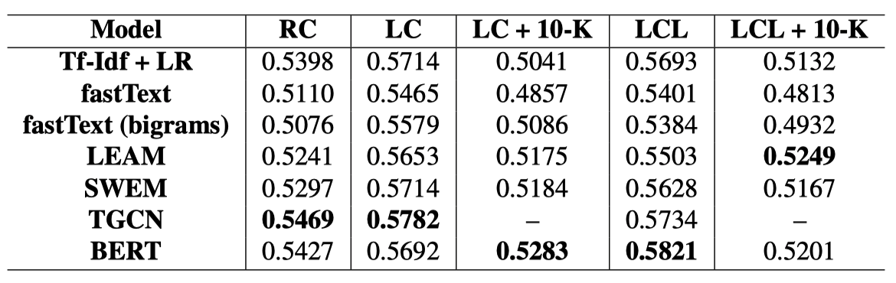
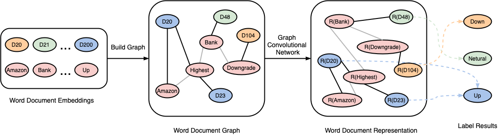
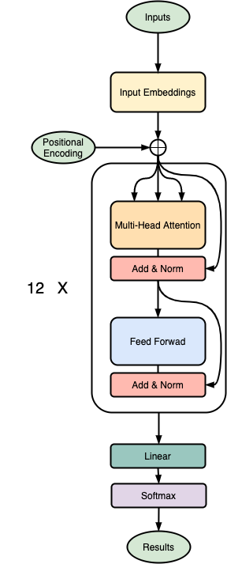

# Stock Price Trend Analysis Using Multiple Novel Models

In this project, we research on the importance of textual data from different sources to predict the stock market trend using GCN and BERT model.

## Requirement

- python 3.6
- tensorflow >= 2.1.0
- pytorch >= 1.4.0
- nltk 3.4.5
- transformers 3.5.1

## Run

### Preprocess

For GCN model:

```
cd ./preprocess
python remove_words.py <dataset>
python build_graph.py <dataset>
```

### Train

For GCN model:
```
python train_tgcn.py <dataset>
```

For BERT model:

```
python train_bert.py <dataset>
```

## Results

<p align="center">

</p>

## Architecture

GCN model:

<p align="center">

</p>

BERT model:

<p align="center">

</p>

## Contributors

- [Yuan Li](yl6606@nyu.edu)
- [Dongzi Qi](dq394@nyu.edu)
- [Mengqi Wu](mw4259@nyu.edu)
